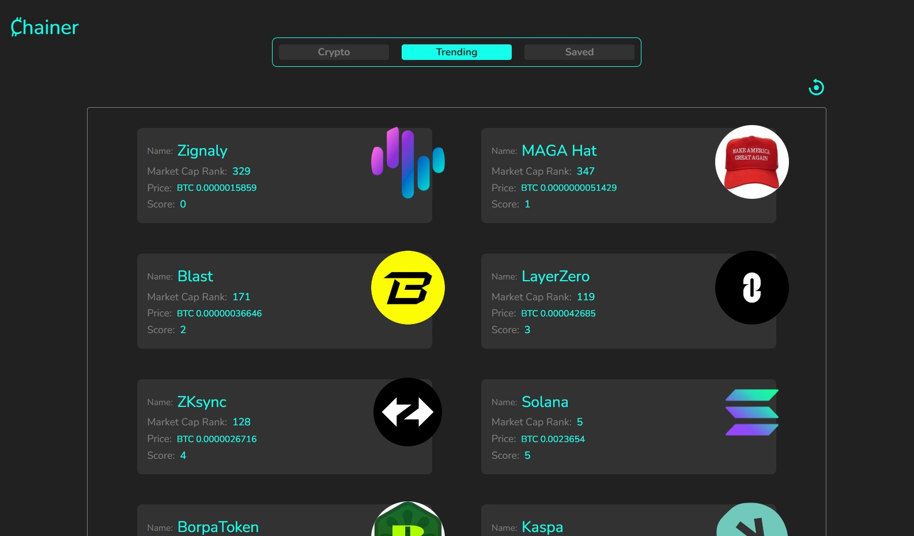

Chainer is a versatile crypto app that offers real-time market data, advanced charting tools, and portfolio management features. The app's user-friendly interface ensures easy navigation and quick access to information.

------------------
Libraries, Resources & Tools:
 * React JS for Components.
 * Tailwind CSS for Styling.
 * Recharts for the chart graphics.
 * CoinGecko API to bring the crypto data.
 * Iconify for icons.
 * Google Fonts ("Outfit" font).

The app has 3 sections: "Crypto", "Trending" and "Saved".

The "Crypto" section contains every crypto data that's in the CoinGecko API. You can search any crypto coin / crypto chain, you can change the currency, you can sort the pages by MarketCap, Volume, ID, and Gecko score.

 ;

The "Trending" section highlights the top 15 cryptocurrencies with the biggest search volume, price movement, trading volume, mentions, etc.

 ;

Make your own crypto watchlist! By clicking on the star icon, you send the item to the "Saved" tab. This tab shows only your saved items, and you can acces it anytime because it will be saved on your Local Storage.

